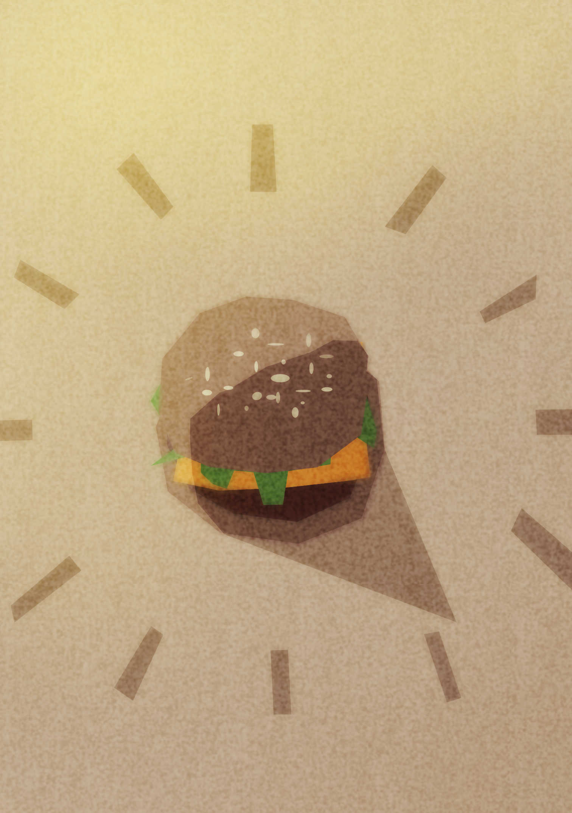

# It's a MC Do smell before 5:30 pm

The incoming of a comet stops all the clocks and calendars on Earth. This comet will be visible only a few seconds at 5:30 pm. You are a photographer and taking a picture of it is the project of your life. But how to know how much time is left before the comet appears in order to have the perfect exposure time ? Observe your environment and exchange with people to find as much clues as possible to guess what time it is.

