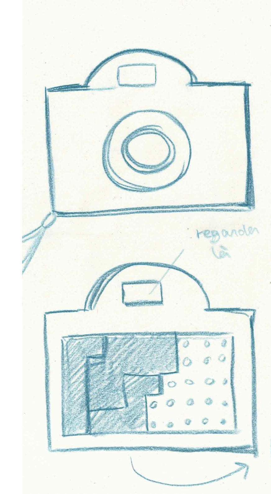

# It's a Broth Smell and a few minutes before the comet

You’re a passionate yet not very talented scientist. Your boss gave you one last chance to avoid firing you. You have to take a picture of an incoming comet. To do this, you have to use the lab's high-tech camera. Everything is automatic so it’s an easy task. But on the very day, the comet stops all the clocks on Earth. Without time, the camera can’t work. And on top of that, you’re all by yourself because all your colleagues are at a convention on the other side of the country.

To save your career, you’ll have to observe your environment to find clues about what time it is in order to enter it manually in the camera and gradually make it work again.

