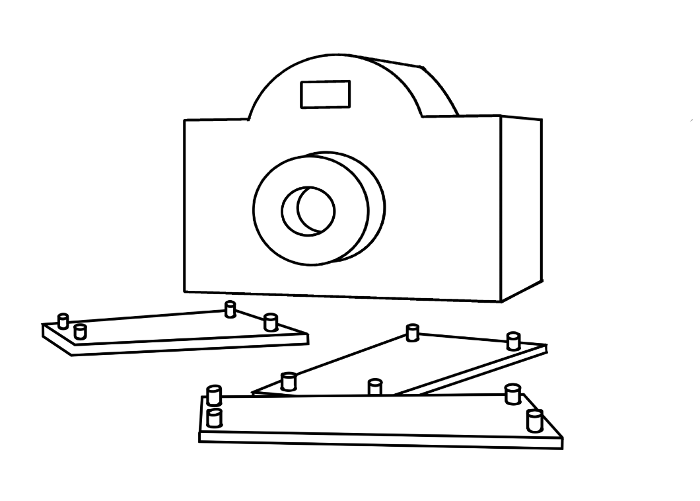

# It’s a broth smell and a few minutes before the comet

You’re a scientist that has to take a picture of an incoming comet to the Earth. You have to use an high-tech camera that automatically takes pictures. But the proximity of the comet stops all the clocks on Earth, including the one in the camera. Since it can’t work properly without it, you have to help it regaining a perception of time by giving it time related elements.
Find the right clues and enter them in the camera in order to make it work again properly and take a picture of the comet.

