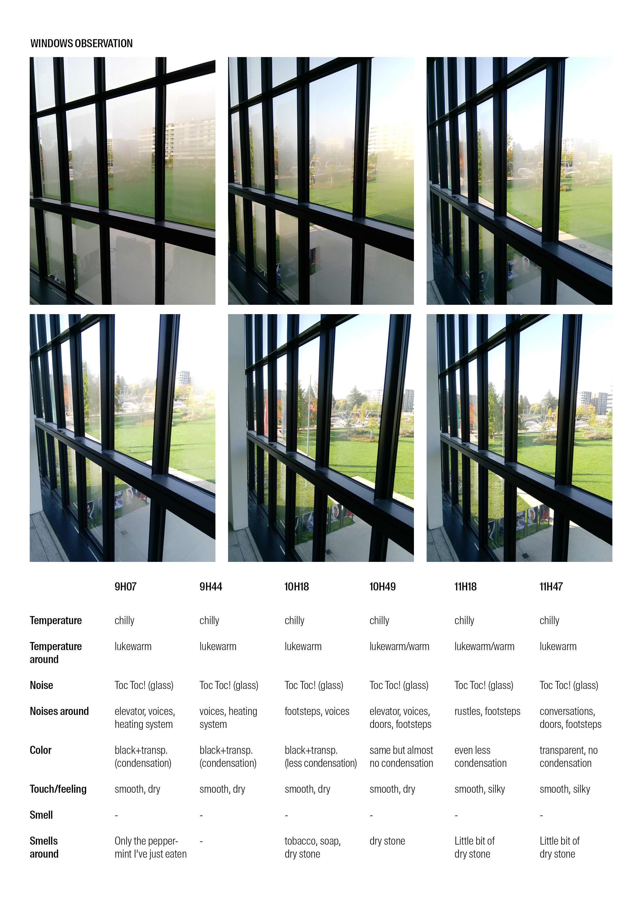

# Sense of time

I observed different subjects every 30 minutes for 3 hours. I wanted to verify if I could see small changes based on my senses in a quite short amount of time. Through these observations, I noticed the importance of the senses in the perception of time. Light, smells, sounds, … play a subtle role in our recognition of different times of the day. So what if everything always stay the same ? No more indications based on our senses possible ! What would be the impact on our relation with time ?

