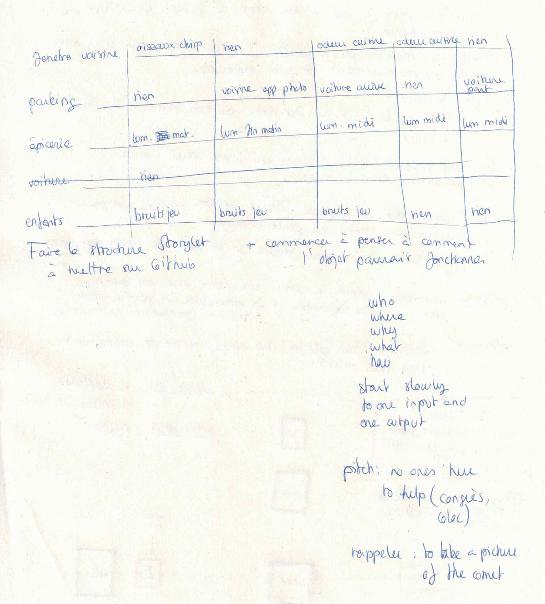
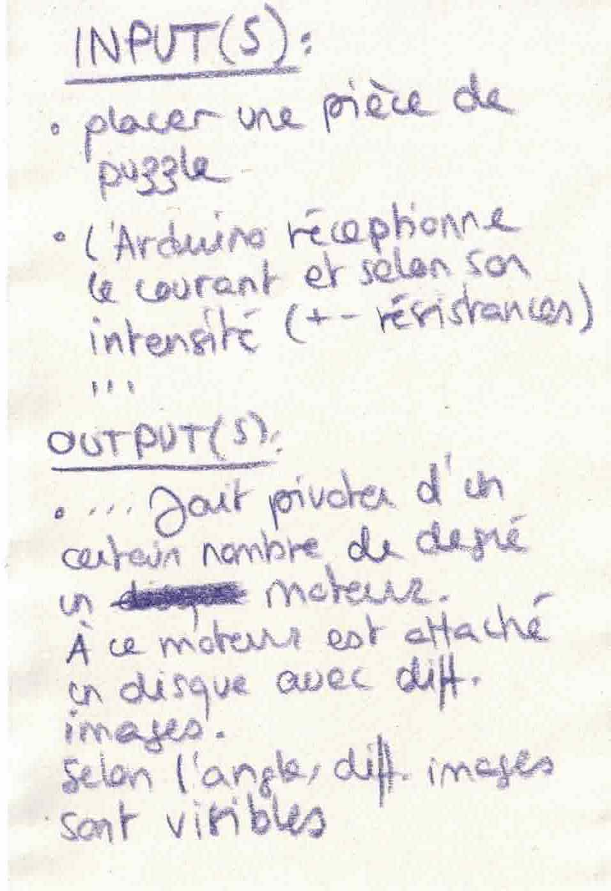
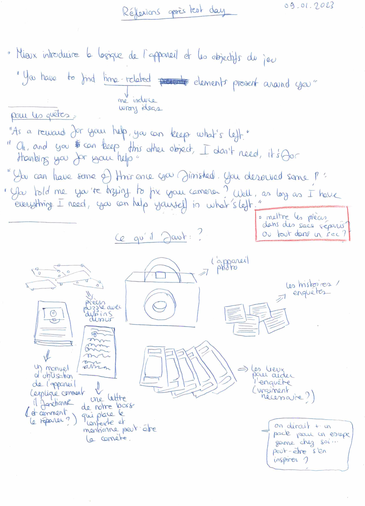

# Time In Time Out Process

My process and researches for the Time In Time Out project !

## 20.10.2022
# How do you percieve time ? - Testimonies

"I percieve time as every moment I wait before the next one. I'm cooking right now and this is a good example. Now, I'm waiting for the stock to reduce. That's my unit of time. Then, I'll be waiting for the meat to be cooked. And then that the udon (noodles) are ready. An indivisible unit. An atom of time. It's no use to cut it in half. I see time as the anticipation of a moment to come."

"When I think of time, I imagine things that are constantly evolving and moving. (As in, the rain finally stopping, my hair falling down because I’m low on iron again, a new building is under construction..) And how I base I am aware of time passing on a day to day basis is especially thanks to the light. When I notice that shadows move and the light intensity changes, I know that time is going by. When there is no natural light, for me time freezes. For example, during a winter evening I might be working for hours, but to me it seems like it’s only been 20 minutes; or when I’m at a bar partying, everything else stops, and then I go outside and I’m shocked to see the first glimpses of sunrise.
And then there’s the classic saying that « time goes by faster when you’re having fun » which I think is true because you are immersed in « the zone » and don’t notice the changes in the environment.
For me calendars and plannera are necessary, otherwise I can loose track of the days and months."

"It's complicated for me since I'm hyperactive. If I'm doing nothing, I have the impresssion that time has stopped. If I'm doing something that I'm interessed in, I don't pay attention and I can stay for hours on my seat without moving. For me, time is like a wheel. If I do nothing, it doesn't move. If I'm active, it starts rolling."

"It depends if I'm absorbed by something or not. If I'm bored, my brain can't hold onto something and time goes pretty slowly. But if I'm doing something that interess me and that litteraly absorbs my notion of time, everything goes pretty/too much quickly. To me, time is like moutains. Sometime, it's hard to cross and to climb and sometime, in descent, it's very enjoyable but always too short."

"It doesn't matter how much time pass, the truth always comes out."

# Personal observations

## Photos fading over time
Photos are an attempt to capture/stop time. But they always end up being themselves impacted by the passage of time.

[For examples, polaroids photos](https://imagerestorationcenter.com/how-long-do-polaroids-last/) have a "close relationship" with time.

[Art project using old polaroids](https://www.images.ch/archives/artiste/cristina-de-middel/)

[Cyanotypes](https://en.wikipedia.org/wiki/Cyanotype#Long-term_preservation) are a bit more special since they have a regenerative behavior.

## How long would it take to a moutain to erode into flat land ?

According to this [website](https://www.quora.com/How-long-would-it-take-for-a-whole-mountain-to-erode-into-flat-land), very long. I think it's interesting to know that something that seems strong and unbreakable to our eyes is slightly changing over time. We don't live long enough to notice the change but it's still happening.

But [climate change](https://www.letemps.ch/suisse/canicule-accelere-lerosion-alpes-accentue-chutes-pierres) is making the eroding more visible.

## The Déjà vu

That feeling when you're sure you know a place even if it's the first time you visit it.
May be caused by [different factors](https://psycnet.apa.org/doiLanding?doi=10.1037%2F0033-2909.129.3.394) but I think the one about how [brain stores memories](https://www.thoughtco.com/causes-of-deja-vu-4159448) is the most interesting.

## Clocks and cuckoo clocks collections

These objects can make a lot of different sounds. The cuckoos seem to have a sort of ritual (waiting for the bird to sing and and little music-dance to play).

[Cuckoo collection example](https://www.youtube.com/watch?v=xHYhd7QAO5U)
[Clock collection example](https://www.youtube.com/watch?v=F5NMnA_13kM)

## Places where we wait

Bus stop

Train station

In the train

Waiting rooms (doctor, dentist, ...)

Administrative buildings

Airports

The elevator

When we have to wait in line

...

## Perception of time in dreams

Maybe try to list some dreams (right after waking up) and how much "time" passed during the dream (a few minutes, hours, days, years, ...).

## When Pop Cultures talks about time perception

[Everything Stays - Rebecca Sugar](https://www.youtube.com/watch?v=xnv65fHoLTQ)

## 27.10.2022
# Looking for slight changes on "non-changing subject" in a short time

Taking pictures every 30 minutes of different subjects and listing my sensorial perception about them in an attempt to percieve small changes.

By "non-changing object" I refer to things ta usually don't drastically change in a few hours or in a day.

## Questions

How to observe changes on non-changing objects in a short amount of time ?

Can changes be only temporary ?

# The Red Queen Hypothesis/Paradox

We have to move to stay in place. 

# Time and regeneration

As said before, Cyanotypes have a regenerative behavior. If a cyanotype loses some colors, it can recover them if placed for a certain time in a dark place.

A certain type of jellyfish can also regenerate itself.

## Questions

Is regeneration being the same as before or being a bit different ?

Restoration is the equivalent of regeneration for objects ?

Is regeneration a way of fighting passing time ?

Or is it a way to stay longer ?

What are human looking for when they think of regeneration ?

## 02.11.2022
# Perceiving time through our five senses.

I asked 6 people (including myself) to observe and list for a few days when they use one of their five senses to estimate what time it is.

Summary of the observations:

## Friday

Person 1: 9H23, fog => winter is near/11H40 => red pepper smell => we are no longer in summer

Person 2: Holidays time so no time markers

Person 3: Sunset and a lot of traffic => +- 17H00

Person 4: -

Person 5: Morning, before the sun rises, weeather chill and moist => must be around 8H30-9H00 / 20H42, McDo smell => must be 20H00

Person 6: -

## Saturday

Person 1: 23H30, people outside being very loud despite the night => we are saturday evening

Person 2: Holidays time so no time markers

Person 3: Mid-light, voices of kids playing outside => must be between 11-13H00 / Later that day, was able to anticipate perfectly the time needed to realise something.

Person 4: 5H30, silence, then, birds starting to chirp => the sun's gonna rise soon / Only a few light in a close buildind => it's really early / 6H30, more car noises => people are starting to go to work / 8H30, in the train, not a lot of sounds, people are quiet = early, off-peak time or very late / Two girls speaking swiss-german => the week-end, people are coming home.

Person 5: -

Person 6: -

## Sunday

Person 1: -

Person 2: Holidays time so no time markers

Person 3: Sense of time is broken => we went from summer time to winter time /Guessed the time right but from the summer time point of view.

Person 4: -

Person 5: -

Person 6: -

## Monday

Person 1: 7H48, a lot of students in the train after a certain time with no students => it's the end of the holiday

Person 2: Holidays time so no time markers

Person 3: Perception of time still based on winter time

Person 4: -

Person 5: 17H15, sunset, pink sky => must be around 18H30 (was actually one hour earlier because of winter time)

Person 6: -

## Others

Person 2 specified that, during working days, they used a lot sounds as a marker (their boss singing indicates +- 12H30, ...). Since they works in a job implying cooking, smell is not a marker for them.

Person 3 use mainly light as time marker.

Person 4 listed some other different time markers as events (market => saturday and wednesday, ...), people (some members of the family present = week-end or holydays), physical reaction (yawn => almost 22H00).

Person 6 noticed nothing.

## From these observations, I noticed different things:

- The most used senses are the hear, the sight and the smell. I have no example with the touch or the taste.
- Time references depend of the context.
- If we are not active (just chilling at home), we use less time references (no need to worry about time, less stimulations, ...)
- Past experiences can play a role in the perception of time.
- Time references are used for different time scales (hours, days, months, seasons, ...)

## Other references

[An article from the BBC](https://www.bbc.com/future/article/20200306-how-to-live-without-time)

## Today's notes

)

## 03.11.2022
# Using time markers to percieve time

[Example of an app playing with the fact that a group of people has to "reunite" during a random time each day.](https://play.google.com/store/apps/details?id=com.bereal.ft&gl=US)

## Today's notes

## 27.11.2022
# Perceiving time through our five senses, round 2

Between 03.11 and 27.11, I asked a few people to list the different things they used to estimate what time it is other than clocks and calendars.

PERSON 1: 
Smell of white wine sauces in the corridor of my building means an old neighbour started cooking => might be around 11H15.
In the morning, see a lot of people coming from the plateforme where I have to take the train => my train has just arrive.
When it's the night and I see a very shiny plane that I often mistake for a star => might be around X hour on the dot.
During the day, light reflecting on objects is almost white and shadows are really small and dark => it's the middle of the day.
Yellow light, long shadows => The sun's gonna set soon, we're approaching the end of the day.
When taking the train, I use the time it takes for a it to go from A to B (f. ex. 10 minutes) to estimates how much time passed.

PERSON 2:
I hear my mother's car during the day => it's 12H10.
I hear my father's bike (or his car if it's raining) => it's 12H15.
I hear my neighbours'voices, they take their children to school => it's 8H00 (actually, I was wrong, it was 9H30).
My father's usually the first one to wake up. If I hear him during holidays => it's around (8H00), excepted some times when he sleeps more.
I wake up and it's warm but when I look outside, I see some snow on the top of the highest mountains => It's fall.

PERSON 3:
My cockatiels being loud and singing more than usual => it's the morning

PERSON 4:
I guess the hour depending of the color of the sky when the sun is rising.
Sailors are having breakfast in one of the cabin of the boat => between 7H30 and 8H00.
Fishermen are back and are preparing the fish and cleaning nets => between 8H15 and 8H30
A woman is waiting at one of the meeting spots to bring children back home => end of school
Parents waiting at the same kind of spot with their children => 8H05
The people helping children to cross the street are here => 8H-8H30, 11H30-12H00. 13H00-13H30 and 15H-15H30
A lot of people at the post office => end of the month, usually saturday (people are paying their bills)
A lot of students in public transports => classes are about to begin or to end, it's around 8H00, 13H30 or 17H00
Cat or guinea pigs are excited => around 17-18H00
I don't sleep well => it's the full moon
Going to the lake with my friends => it's Sunday, Monday, Wednesday or Friday
At the lake, a lot of people, then no one and again a lot of people, the same in museums => lunchbreak
Children at the playground crying and not wanting to go home => around 17H00
In summer, cars are leaving a parking => midday or around 17H00
Winter, ski, a lot of people are going down the ski run at the same time => end of the day, around 17H00
Chimney smoke or grilled chestnuts smell => it's fall
Using flowers and plants to guess the time of the year => tulips for june, magnolia, japanese cherry, peonies, ... for spring, kiwi trees are losing their leaves, which means it's gonna be time to gather the fruits => around november, ...

PERSON 5:
Waking up and seing light through the window => it's the morning
Going back to sleep, waking up later and hearing the family eating => midday

PERSON 6:
Specific bells sound => Midday
In summer, specific sunlight in my room helps me to guess what time it is.
One of my friend is eating a snack => it's around 10H00
In the train, people are putting their coat on => the train's gonna arrive at the station soon.

PERSON 7:
Don't have specific time markers and the few ones I had can't be used since I moved in another town.

## Notes about the structure of the prototype made with Twine

## 28.11.2022
# Today's notes

## 29.11.2022
# Today's notes

## 04.12.2022
# Potential references and idea for the interactive device

[Arduino's ancestor/cousin ?](https://www.youtube.com/watch?v=GYTbxkCllEI)

[(Almost) no-screen puzzle games examples](https://www.youtube.com/watch?v=TehroYRUlfE)

[Tangram puzzles](https://www.artesanum.com/product/2047401/tangram)

[Rush Hour, a puzzle (?) classic](https://www.youtube.com/watch?v=HI0rlp7tiZ0)

[Maybe and idea for "moving while revealing something" ?](https://www.youtube.com/watch?v=SsoZU6S8Ofc)

## 05.12.2022
# Storylet example and Input/Output ideas

## Other puzzle references

[A circuit puzzle](https://www.youtube.com/watch?v=cVGzmkKIAMM)

[A lego bracelet, cool idea for the wearable](https://www.mightyape.co.nz/product/lego-dots-cool-cactus-bracelet-41922/34561021)

The link isn't working properly so I just put a screenchot from the website:

## 06.12.2022
# Today's notes and some more links

New idea for the interactive device :

[View Master (I know it's the wikipedia page but the original (?) website wouldn't load...)](https://fr.wikipedia.org/wiki/View-Master)

[Fisher Price Camera](https://www.fnac.com/Appareil-Photo-Fisher-Price/a7229164/w-4)

## 08.12.2022
# Today's notes

## 12.12.2022
# Today's notes and documentation

Documenting myself about astrophysics laboratories.

[Laboratoire d'Astrophysique de Marseille](https://www.lam.fr/laboratoire/presentation/)

[Au cœur du Laboratoire d'Astrophysique de Marseille](https://www.youtube.com/watch?v=qFiCh0UHAc4)

[Film laboratoire d'astrophysique de Marseille](https://www.youtube.com/watch?v=beSo7IXM2UU)

[UNIGE - Astronomy Department](https://www.unige.ch/sciences/astro/en/about-us/astronomy-department/)

[L'observatoire du Pic du Midi](https://1001nuitsinsolites.com/lobservatoire-du-pic-du-midi/)

[Futura - Qu'est-ce qu'une comète](https://www.youtube.com/watch?v=5AT2VRmyxG0)

[I filmed Comet Neowise with my 12 inch Telescope !!!!](https://www.youtube.com/watch?v=r4dWMKE00hM)

I also checked Cluedo's rules, mostly for the gameboard.

[Cluedo](https://www.regledujeu.fr/cluedo/)

## 09.01.2023
# Today's notes and documentation

I first thought to inspire me from "escape games to play at home" but quickly abandoned the idea.

[A website listed some games](https://www.dicebreaker.com/mechanics/escape-room-game/best-games/best-escape-room-games)

[Print + cut Escape game](https://cluequest.co.uk/print-cut-escape/index)

[Us unlock! escape game](https://www.spacecowboys.fr/unlock-demos-english)

## 

